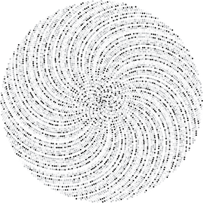

# Algorithms

## Graph Theory

> In mathematics, graph theory is the study of graphs, which are mathematical structures used to model pairwise relations between objects. A graph in this context is made up of vertices, nodes, or points which are connected by edges, arcs, or lines.  

Basic algorithms of graph theory.

- Graph Representation
- Graph Traversal
- Shortest Paths
- Trees

## Number Theory

> Number theory, is a branch of pure mathematics devoted primarily to the study of the integers. 

Basic algorithms of number theory.

- Primes and Factors