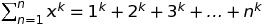

# Basic Techniques

## Introduction

### Modular Arithmetic

```markdown
(a + b) mod m = (a mod m + b mod m) mod m
(a - b) mod m = (a mod m - b mod m) mod m
(a * b) mod m = (a mod m * b mod m) mod m
```

### Floating Point Numbers

Due to loss of precision, we can't accurately compute floating point numbers. So checking equality in floating point numbers can cause bugs. So use below method to check for equality.

```python
# Two floating point numbers
a = 0.1 + 0.1 + 0.1 + 0.1 + 0.1 + 0.1 + 0.1 + 0.1 + 0.1+ 0.1
b = 0.1*10
# Precision
epsilon = 1e-9
if abs(a-b)<=epsilon:
    # Equal floating points
    print("Equal")
```

### Sum Formulas

Each sum of the form 



where k is a positive integer, **has a closed-form formula that is a polynomial of degree k +1**. See [Faulhaber’s formula](https://en.wikipedia.org/wiki/Faulhaber%27s_formula).

