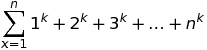
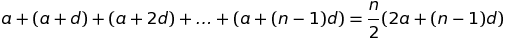
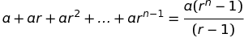
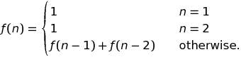
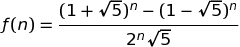
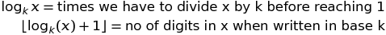

# Basic Techniques

```markdown
# Inserting Equations for this page


[Encode EQUATION](https://www.url-encode-decode.com)
```

## Mathematics

### Modular Arithmetic

```markdown
(a + b) mod m = (a mod m + b mod m) mod m
(a - b) mod m = (a mod m - b mod m) mod m
(a * b) mod m = (a mod m * b mod m) mod m
```

### Floating Point Numbers

Due to loss of precision, we can't accurately compute floating point numbers. So checking equality in floating point numbers can cause bugs. So use below method to check for equality.

```python
# Two floating point numbers
a = 0.1 + 0.1 + 0.1 + 0.1 + 0.1 + 0.1 + 0.1 + 0.1 + 0.1+ 0.1
b = 0.1*10
# Precision
epsilon = 1e-9
if abs(a-b)<=epsilon:
    # Equal floating points
    print("Equal")
```

### Sum Formulas

Each sum of the form



where k is a positive integer, **has a closed-form formula that is a polynomial of degree k +1**. See [Faulhaber’s formula](https://en.wikipedia.org/wiki/Faulhaber%27s_formula).

### Arithmetic Progression



### Geometric Progression



### Sets

A set with `n` elements has `2^n` elements including empty set.

### Fibonacci Numbers



There is a closed form formula to calculate nth Fibonacci number, called **Binet's Formula**.



### Logarithm

Useful property of logarithm is that,



## Time Complexity

| Time Complexity | Description                                                  | Input Size(for 1s) |
| --------------- | ------------------------------------------------------------ | ------------------ |
| `O(1)`          | Constant time algorithm. Most likely a direct formula.       | `any`              |
| `O(log(n))`     | Algorithm which halves the input size at each step.          | `any`              |
| `O(sqrt(n))`    | Algorithm which search only until the middle of the input.   | `10^13`            |
| `O(n)`          | Algorithm which goes through each input a constant number of times. | `10^7`             |
| `O(nlog(n))`    | Algorithm which sorts the input or uses a data structure which takes `O(log n)` time for each input | `5*10^5`           |
| `O(n^2)`        | Algorithm which goes through all pairs in input.             | `3000`             |
| `O(n^3)`        | Algorithm which goes through all triplets in input.          | `200`              |
| `O(2^n)`        | Algorithm which goes through all subsets of input.           | `20`               |
| `O(n!)`         | Algorithm which goes through all permutations.               | `10`               |


