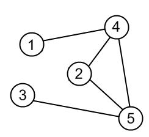

# Graph Representation

## Unweighted Graph Representation Examples

Adjacency List, Adjacency Matrix and Edge List representation of same graph.

**File: `a_unweighted.py`**

------------------------------

## Weighted Graph Representation Examples

Adjacency List, Adjacency Matrix and Edge List representation of same graph.

**File: `a_unweighted.py`**

------------------------------

## Graph Representation Conversion Functions

| Convert From     | Convert To       | Function Name                       |
| ---------------- | ---------------- | ----------------------------------- |
| Adjacency List   | Adjacency Matrix | `adjacency_list_to_adjacency_matrix()` |
| Adjacency List   | Edge List        | `adjacency_list_to_edge_list ()` |
| Adjacency Matrix | Adjacency List   | `adjacency_matrix_to_adjacency_list ()` |
| Adjacency Matrix | Edge List        | `adjacency_matrix_to_edge_list ()` |
| Edge List        | Adjacency List   | `edge_list_to_adjacency_list ()` |
| Edge List        | Adjacency Matrix | `edge_list_to_adjacency_matrix ()` |

**Unweighted Graphs : `c_unweigted_conversion.py`**

**Weighted Graphs :  `d_weigted_conversion.py`**