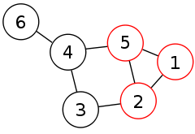
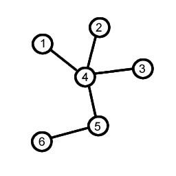

# Graph Traversal

## Depth First Search Examples

Depth First Search implementation using recursion and iteration. Tested on below graph.

**File: `a_dfs.py`**

## Breadth First Search Example

Breadth First Search Implementation using iteration and Shortest distance between two nodes using BFS. Tested on above first graph.

**File: `b_bfs.py`**

## Connectivity Check

Algorithm to check whether the given graph is connected or to find all components in a graph. Implemented using DFS. Tested on above first graph.

**File: `c_usage_connectivity.py`**

## Cycle Check

Algorithm to check whether the given graph contains a cycle (in general case) and a faster algorithm to check whether given connected unidirectional graph has a cycle. Both algorithms tested on following graphs.

**File: `d_usage_cycles.py`**

## Bipartite Checking

Bipartite checking algorithm witch uses DFS. Tested on above second and third graphs.

**File: `e_usage_coloring.py`**

## Time Complexities

| Algorithm                   | Description                                                  | Time Complexity |
| --------------------------- | ------------------------------------------------------------ | --------------- |
| `dfs_recursion()`           | Recursively use DFS and find all nodes which can be visited from one node. *Suitable only for graphs with less than 1000 nodes.* | `O(n+m)`        |
| `dfs_iter()`                | Above algorithm iteratively. Suitable for any graph.         | `O(n+m)`        |
| `bfs_iter()`                | Use BFS to find all nodes which can be visited from one node. | `O(n+m)`        |
| `bfs_distance()`            | Use BFS to find shortest between 2 nodes.                    | `O(n+m)`        |
| `is_connected()`            | Check whether given graph is connected or not.               | `O(n+m)`        |
| `list_components()`         | Get a set of all components in a graph.                      | `O(n+m)`        |
| `contains_cycle()`          | Check whether graph contains a cycle.                        | `O(n+m)`        |
| `contains_cycle_specific()` | Check whether graph contains a cycle. *Works only for connected, undirected graphs.* | `O(n)`          |
| `is_bipartite()`            | Check whether a graph is bipartite.                          | `O(n+m)`        |

`n` = no of nodes

`m` = no of edges