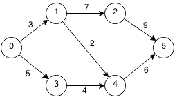
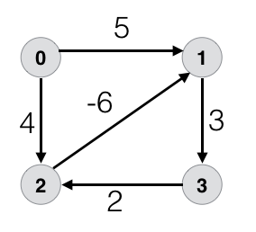

# Shortest Paths

## Bellman-Ford Algorithm

Bellman-Ford Algorithm implementation for a graph represented with an edge list. Returns empty list if contains a negative cycle. Tested on below graphs.

 

 

