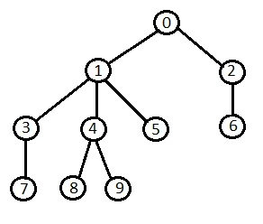

# Tree Algorithms

## Tree Traversal

Depth First Search implementation using recursion and iteration. Depth First Search implementation using  iteration. Dynamic Programming example demonstrated by using recursive solution to count all sub tree nodes starting from a node. Tested on below tree.

**File: `a_tree_traversal.py`**

## Diameter

Finding diameter of a tree using Algorithm A and algorithm B. Algorithm A in implemented recursively. Algorithm B is implemented iteratively. Tested on above tree.

**File: `b_diameter.py`**

## All Longest Paths

All longest paths starting from each node. Algorithm A in implemented recursively. Trivial to convert to iterative function. Tested on above tree.

**File: `c_longest_paths.py`**

