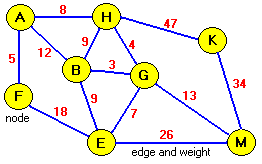
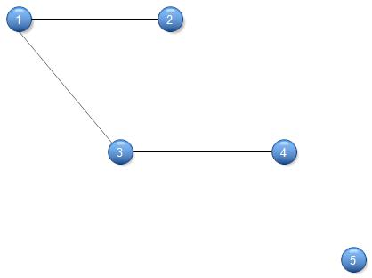
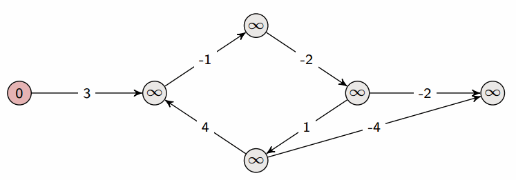
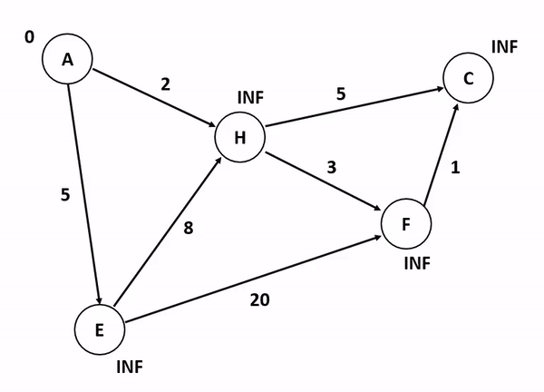
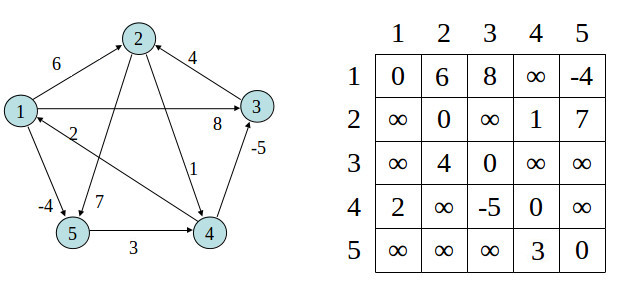

# Graph Theory

## Graph Terminology

A graph consists of **nodes** and **edges**. In above graph `A, B, E, F, G, H, K and M` are nodes. All connectors are edges.

 **Path** is the way to to reach from one node to another. Path from `A to M` is `A → B → G → M`. Note that there could be more than one path between two nodes. **Simple path** is a path which does not contain same node several times in it. `A → F` is simple, but `A → B → H → A → F` is not simple.

Graph is **connected** if there is a path between any two nodes meaning that you should be able to reach another node by starting from any other node.

**Components** are each separate part of a graph. In below graph `{1, 2, 3, 4}` and `{5}` are the components of the graph.

**Tree** is a *connected undirected*  graph with *n-1* nodes so there is one and only one *unique* path between any two nodes. If we take `{1, 2, 3, 4}` component of above graph as a separate graph, it would be a tree.

**Weighted graph** is a graph which has weight to every edge. Topmost Image is a weighted graph whereas above image is not. These weights can be imagined as lengths of the edges.

**Neighbor nodes or adjacent nodes** are nodes which have one edge between them. In first image `B, H and F` are neighbors of `A`.

**Degree** of a node is number of neighbors it has (or number of edges it has). So degree of `A` is 3. *Sum of degrees of a graph is `2m` where `m` is number of edges.* **Indegree** is number of incoming edges a node has. Similarly **outdegree** is number of outgoing edges. **Regular graph** is a graph in which all nodes have same degree. **Complete graph** is a graph which has `n-1` edges (meaning all nodes are connected to each other).

**Coloring** a graph means giving nodes colors so that no neighbor nodes have the same color. **Bipartite graph** is a graph which can be colored by using 2 colors. *A graph is not bipartite if and only if it contains a cycle with odd number of nodes.*

**Simple graph** is a graph which does not have edges that start and end at the same node and does not have multiple edges between two nodes.

## Graph Representation

A graph can be represented in

- Adjacency List
- Adjacency Matrix
- Edge List

## Graph Traversal

A graph can be traversed using mainly two algorithms.

### Depth First Search Algorithm

Starts from a node and visits all nodes that can be visited from that node recursively. Uses a `stack`data structure when implemented iteratively.

> Time complexity is O(n+m)

### Breadth First Search

Starts from a node and visits all nodes in increasing distance. So closest nodes are visited first. `Queue` data structure is used to this algorithm. Can be used to measure **shortest distance** between two nodes. **This is the best way to measure shortest distance between two nodes if the graph is unweighted.**

> Time complexity is `O(n+m)`

### Usages

#### Connectivity Checking

Can use simple DFS to check whether a graph is connected by checking whether no of nodes discovered when started from a random node equals no of all nodes in the graph. Can also use DFS to identify graph components.

#### Cycle Checking

Checking whether a graph has a cycle in it can be done using DFS by basically traversing the graph while checking whether it finds a node it previously found (indicating there is a cycle).However this search needs to remember previous node since `A → B → A` is not a cycle but is possible in a unidirectional graph. So if DFS finds a node previously found but is not the node before, it means that there is a cycle.

Second algorithm uses the fact that if a graph is connected, unidirectional and cycle-less it has to be a tree. Since tree contains `n-1` edges where `n` is number of nodes, Connected, unidirectional and cycle-less graphs have to have `n-1` edges. **So if a graph is connected and unidirectional it is cycle-less if and only if it has `n-1` edges.**

#### Bipartite Checking

Checking whether a graph can be colored using only 2 colors so that no neighboring cell contains same color, can be implemented using DFS. Method is to start from any node and start coloring until there is no node left or it finds a neighboring node with same color.

## Shortest Paths

**If the graph is unweighted, best algorithm to use is Breadth First Search**, which has a time complexity of `O(n+m)`. However if graph is weighted we have to use other algorithms which have worst time complexity than BFS.

### Negative Cycles

Shortest distances are not defined if graph contains a negative cycle which means that sum of weights of the particular cycle is negative. If this is the case we can go though that cycle infinite no of times because going though it reduces our total distance. Some algorithms like *Bellman-Ford Algorithm* can detect presence  of negative cycles whereas some cannot which results in wrong answers.

### Bellman-Ford Algorithm

**Slow** algorithm to **find distance from one node to all other nodes**. **Distances can be negative**. **Can detect negative cycles.**

This algorithms requires graph to be represented as an **edge list**. However it is easy to convert adjacency list or adjacency matrix and it has time complexity of `O(n+m)`. So Bellman-Ford Algorithm time complexity wont change.

- Set distance to all nodes as `INF` except for starting node. Distance to starting node in `0`.
- Iterate through all edges (one-directional edges, if edges are unidirectional same edge have to be processed twice in both ways) and set *distance to the second node* as *distance to first node + weight of the edge* if and only if that distance is less than already computed distance for second node.
- Do this `n-1` times  where n is no of nodes. Algorithm can stop midway if it detects no distances were changed in a iteration.
- This algorithm can detect *negative cycles* by iterating through `n` times (instead of `n-1`) and checking whether distances changed in the last iteration.

> Time Complexity is `O(nm)`

### Dijkstra Algorithm

**Fast** algorithm to **find distances from one node to all other nodes**. **Distances MUST BE positive**. If it contains negative lengths/weights this will give a wrong answer. This algorithm uses the fact that all distances are positive to process each edge only once.

- Set distance to all nodes as `INF` except for starting node. Distance to starting node in `0`.
- Start from starting node.
- For each edge starting from the current node, find the distance to the neighbor if corresponding edge is used. Distance can be found by, *shortest distance to current node +  weight of the edge between*. If the distance calculated in this manner is less than current shortest distance to neighboring node, update its shortest distance and add it to list of the nodes which will be processed next.
- Then select the node with shortest distance from the list of list of nodes. Remove the node from the list after it is selected. The repeat above process for that node.
- Do this until you have no nodes to process.
- In this way each edge will be processed only once.

This should be processed using a `priorityQueue` (or `heapq` in python) in order to efficiently get node with minimum distance each time.

> Time Complexity(`PriorityQueue`) is `O(n+mlogm)`. Otherwise `O(n^2)`

### Floyd-Warshall Algorithm

**Slow** algorithm to **find distances between all nodes**. If it contains negative lengths/weights this will give a wrong answer.  This is easy to implement but not suitable for large graphs.

- Create a distance grid from graph so that distance from a node to itself is `0` and distance from node `A` to node `B` is the weight of edge between `A` and `B`. If no direct edge exists, distance in `INF`.
- Take each `C` node as an intermediate node. Then take any two nodes `A` and `B` from the graph. If minimum distance in the path `A → C → B` is less than `A → B`, then update distance grid.
- In the end grid will contain minimum distances between any two nodes

> Time Complexity is `O(n^3)`
