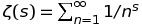
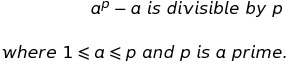
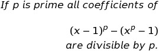

# Interesting Mathematical Concepts

## Numberphile

### The Four Color Map Theorem

Any map can be colored with 4 colors.

- Any map can be reduced to a network/graph. But not every graph can be represented in a map. Only the graphs which can be represented in graph so that edges do not cross can be represented in maps.
- Any node must have lower than or equal to 5 neighbors.
- This can similarly be used to show that only 4 different frequencies are required to stop radio towers from interfacing from each other.

https://www.youtube.com/watch?v=NgbK43jB4rQ

### Goldbach Conjecture

- Any even number larger than 2 can be expressed as sum of 2 prime numbers.(**NOT PROVEN**)
  - `p + q = e`
- Every odd number greater than 5 can be expressed as sum of three primes. (**PROVEN**)
  - `p + q + r = o`
- Every odd number greater than 5 can be expressed as the sum of prime and twice a prime.(**NOT PROVEN**)
  - `p + 2q = o`

https://www.youtube.com/watch?v=MxiTG96QOxw

### Twin Prime Conjecture

- There are infinitely many twin primes. (**NOT PROVED**)
  - There are infinite prime numbers `p` such that `p and p+2` are both primes
- It was proved that `246` is a lower bound. (**PROVED**)
  - There are infinite prime numbers `p` such that `p and p+x` are both primes where x is between `2` and `246`.

https://www.youtube.com/watch?v=QKHKD8bRAro&t=936s

### Glitch Primes and Cyclops Numbers

- Only binary cyclops number (eg: `101`, `11011`, `1110111`, `111101111`) which is a prime number is `101` or 5.

https://www.youtube.com/watch?v=HPfAnX5blO0

### Riemann Hypothesis

- `zeta(1)` is `UNDEFINED`. 
- Every value for `s` where `zeta(s)=0` is found as `1/2 + ki`.

https://www.youtube.com/watch?v=d6c6uIyieoo

### Primality Tests

- **Fermat's Little Theorem** is a primality test which is not `100%` accurate. However only `2183` numbers fail this test for `a=2` within `25 billion` numbers. Test says that,

- **Braillie-PSW** is also a test. This is used after Fermat's Little Theorem test to confirm whether number is prime. Currently there have no counter-examples found which fail both Fermat's Little Theorem and Braillie-PSW test.
- **Miller-Rabin** is also a primality test.
- **AKS Test** is a `100%` true test. It is also very fast.

https://www.youtube.com/watch?v=jbiaz_aHHUQ
https://www.youtube.com/watch?v=8UqCyepX3AI