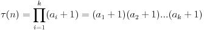
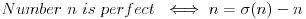
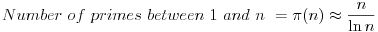

[TOC]


# Number Theory

Number theory is a branch of mathematics that studies integers.  

```markdown
# Inserting Equations for this page


```

[Encode Equation](https://www.url-encode-decode.com)

## Primes and Factors

A number `a` is called a **factor** or a **divisor** of a number `b` if `a` divides `b`.  This is denoted by `a|b`. A number `n>1` is a **prime** if its only positive factors are 1 and `n`.  For every number `n>1`, there is a unique **prime factorization**.


### Number of Factors

Number of factors  of `n` is,



because for each prime there are `(a+1)` choices for their powers including `0`.

### Sum of Factors

Sum of factors of `n` is,


where the latter equation is based off geometric progression formula.

### Product of Factors

Product of factors of `n` is,


because we can form `number of factors/2` pairs from the factors, each with product `n`.

### Perfect Numbers

Perfect number is a number in which sum of factors below the number is equal to the number itself.



### Number of Primes

There infinite number of primes.

### Density of Primes

The density of primes means how often there are primes among the numbers.  If `pi(n)` denotes number of primes between `1` and `n` then,



### Conjectures

#### Goldbach’s Conjecture

- Any even number larger than 2 can be expressed as sum of 2 prime numbers.`p + q = e`
  very odd number greater than 5 can be expressed as sum of three primes.`p + q + r = o`
  Every odd number greater than 5 can be expressed as the sum of prime and twice a prime.`p + 2q = o`

#### Twin Prime Conjecture

- There is an infinite number of pairs of the form `{p, p+2}`, where both `p` and `p+2` are primes.

#### Legendre’s Conjecture

- There is always a prime between numbers `n^2` and `(n+1)^2`, where n is any positive integer.

### Prime Checking

If a number `n` is not prime, it can be represented as a product `a*b`, where `a<=sqrt(n)` or `b<=sqrt(n)`, so it certainly has a factor between `2` and `sqrt(n)`.

> Time Complexity : `O(sqrt(n))`

### Prime Factorization

Prime factorization can be done following the same procedure above.

> Time Complexity : `O(sqrt(n))`

### Sieve of Eratosthenes

The sieve of Eratosthenes is a preprocessing algorithm that builds an array using which we can efficiently check if a given number between 2...n is prime and, if it is not, find one prime factor of the number.  

> Time Complexity : `O(n log(log(n))`

### Euclid’s algorithm

The greatest common divisor of numbers `a` and `b`, `gcd(a,b)`, is the greatest number that divides both `a` and `b`, and the least common multiple of `a` and `b`, `lcm(a,b)`, is the smallest number that is divisible by both `a` and `b`.


**Euclid’s algorithm** provides an efficient way to find the greatest common divisor of two numbers. The algorithm is based on the following formula:


> Time Complexity : `O(log(n)) where n=min(a,b)`

### Euler’s totient function

**Numbers `a` and `b` are coprime if `gcd(a,b)=1`.** Euler’s totient function `phi(n)` gives the number of coprime numbers to n between `1` and `n`.


> Time Complexity : `O(sqrt(n))`

## Modular arithmetic

In modular arithmetic, the set of numbers is limited so that only numbers 0,1,2,...,m-1 are used, where m is a constant. Each number x is represented by the number x mod m: the remainder after dividing x by m. 

```mathematica
(a + b) mod m = (a mod m + b mod m) mod m
(a - b) mod m = (a mod m - b mod m) mod m
(a * b) mod m = (a mod m * b mod m) mod m
(a^b) mod m = (a mod m)^b mod m
```

### Modular exponentiation


Above function gives fast exponentiation that multiplying.

> Time Complexity : `O(log(n))`